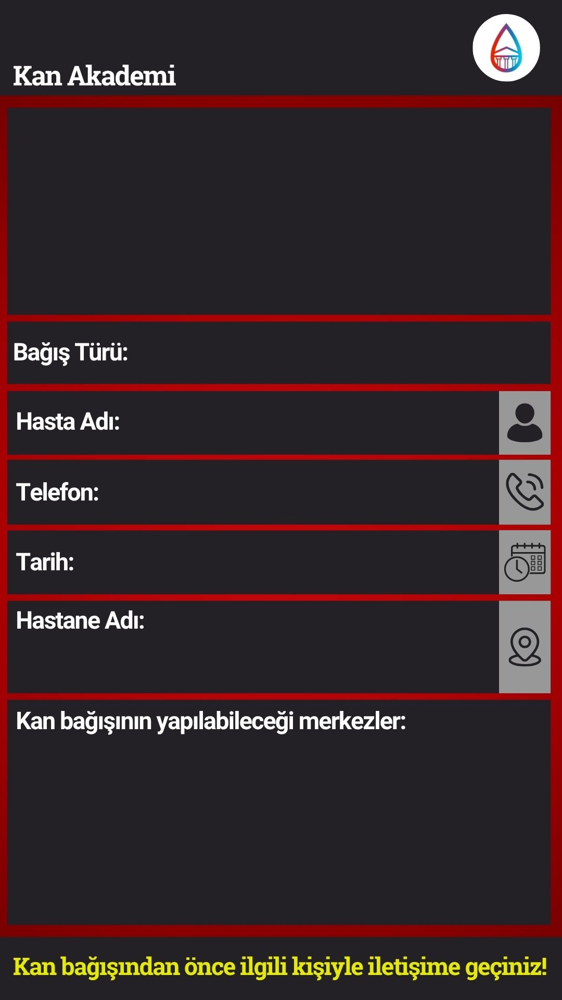

# Kan İlanı Oluşturma Asistanı

Bu proje, kan bağışı ihtiyacı olan hastalar için kolayca ilan oluşturulmasını sağlayan bir web uygulamasıdır. Kullanıcılar, hasta bilgilerini ve kan ihtiyacını girerek ilan oluşturabilirler.

## Özellikler

- Kan grubu, bağış türü, hasta adı, telefon, tarih ve hastane/bağış yeri gibi bilgileri girme
- Girilen bilgilerle otomatik görsel oluşturma ve indirme
- Türkçe ve İngilizce dil desteği
- Koyu ve açık tema seçeneği
- Kişisel verilerin gizliliği (veriler kaydedilmez, paylaşılmaz)
- Mobil ve masaüstü uyumlu arayüz

## Kurulum

1. Depoyu klonlayın:
   ```sh
   git clone https://github.com/kan-akademi/kan-ilani-olusturma-asistani.git
   cd kan-ilani-olusturma-asistani
   ```
2. Bağımlılıkları yükleyin:
   ```sh
   npm install
   ```
3. Geliştirme sunucusunu başlatın:
   ```sh
   npm run dev
   ```
4. Uygulamayı [localhost:5173](http://localhost:5173) adresinde görüntüleyebilirsiniz.

## Derleme ve Yayınlama

- Projeyi derlemek için:
  ```sh
  npm run build
  ```
- GitHub Pages'e yayınlamak için:
  ```sh
  npm run deploy
  ```

## Kullanım

1. Formdaki tüm alanları eksiksiz doldurun.
2. "Son Adım" butonuna tıklayarak ilan görselini oluşturun ve indirin.
3. Görseli sosyal medya veya ilgili platformlarda paylaşabilirsiniz.

## Ekran Görüntüsü



## Katkı Sağlama

Katkıda bulunmak için lütfen [CONTRIBUTING.md](.github/CONTRIBUTING.md) dosyasını inceleyin.

## Lisans

Bu proje [CC-BY-NC 4.0 + Ek Koşullar](LICENSE.md) ile lisanslanmıştır.

## İletişim

Sorularınız veya önerileriniz için [GitHub Issues](https://github.com/kan-akademi/kan-ilani-olusturma-asistani/issues) üzerinden iletişime geçebilirsiniz.

---
Her katkınız bir can kurtarmaya yardımcı olabilir.
